# NEXUS: Networked Emergent X-agent Universe Simulator

<p align="center">
  NEXUS Say NO! to "官味" 文章 / "高度重复" 内容🙅，只做你真正想要、真实的信息✅ —— 融合现实因子动态变化，利用多视角跳出条条框框，催生另辟蹊径的新Idea💥。配合提速60%的极速分析引擎，让你在30分钟内，仅消耗低成本¥2，即可获得原本数日数据收集才能挖掘的深度洞见🔍
</p>

<p align="center">
  <span style="font-size:20px; color:#e63946;">🌙✨</span>
  <span style="font-size:20px; color:#f77f00; font-weight:bold;">棋局未展先知手</span><br>
  <span style="font-size:20px; color:#2a9d8f; font-weight:bold;">月落星沉自有时 🌌</span>
</p>

## 📊 1.Preview

> NEXUS 系统实现 从“信息分析” →“社会系统仿真” (融合现实世界的真实、经验证信息流)

### 🌟 NEXUS 新特点包括：

- 🚀 **告别“正确废话”，NEXUS 拒绝大众模板** 🔥🔥🔥
(基于用户个人真正关注的认知突破)
    - 深度搜索<u>用户真正关心</u>的内容，NO <del>"大众化、泛泛而谈信息"</del> 🙅
    - 建立 <u>"用户独享" Cognitive Map</u>，NO <del>"千人一面分析"</del> 
    - 📖 optional material：
        - Farshidi et al. (2024), *Understanding user intent modeling for conversational recommender systems*, [🔗 Springer Nature Link](https://link.springer.com/article/10.1007/s11257-024-09398-x)
        - Nguyen et al. (2018), *A Capsule Network‑based Embedding Model for Search Personalization*, [🔗 arXiv](https://arxiv.org/abs/1804.04266) 

- 🔗 **不依赖单一、重复数据，NEXUS 整合高质量信源** 🔥🔥
(深度搜索高度贴合 + 保真度的信息源)
    - <u>接入 domain-specific 的微调模型</u>，NO <del>"通用LLMs"</del> 🙅
    - **用户关注锚点驱动**的信息理解机制，NO <del>"无差别信息处理"</del> 

- 📈 **不限于预测，NEXUS 在动态推演未来的隐藏趋势**
    - **考虑现实的、实时的真实、动态影响因子**🔥🔥, NO <del>"静态 or 理想化假设"</del> 🙅
    - 构建<u>高保真的数智孪生世界</u>，NO <del>"理想化假设的虚拟世界"</del> 🙅
    - 📖 optional material：
        - Guo et al. (2025), *Beyond Static Retrieval: Opportunities and Pitfalls of Iterative Retrieval in GraphRAG*, [🔗 arXiv](https://arxiv.org/abs/2509.25530)  
        - Zhu et al. (2025), *Conversational Intent‑Driven GraphRAG*, [🔗 arXiv](https://arxiv.org/abs/2506.19385)  

- 💡 **不搬运常识，NEXUS 生产深度创新认知, 卷！视角深度**
(多视角呈现，支持 jump outside of the box 认知突破)
    - **眼前一亮的新 idea**🔥🔥， NO <del>"大道理的死板分析 or 老生常谈的生硬"</del> 🙅
    - **生动仿真的内心独白**🔥，NO <del>"表面化的虚情假意分析"</del> 🙅
    - 📖 optional material:
        - Zhong et al. (2023), *Beyond Sentiment: Cognitive and Narrative Open‑Ended Generation*, [🔗 arXiv](https://arxiv.org/html/2502.13925v1)
        - Saunders (2012), *Towards Autonomous Creative Systems: A Computational Approach*, *Cognitive Computation*, 4(3), 216–225.  [🔗 Article link](https://www.robsaunders.net/publication/towards-autonomous-creative-systems-a-computational-approach/) :contentReference[oaicite:0]{index=0}

- 💡 **不只一个视角，NEXUS 保真模拟多面未来** 🔥🔥🔥
    - 政府与政策制定者 ⚖️ (e.g: 政策制定、监管机构 / 政策智库Think Tanks...)
    - 企业与市场参与者 💰 (e.g: 投资机构 / Corp企业 / 商业分析机构 VC, PE...)
    - 公众与社群舆论场 🧑‍🤝‍🧑 (e.g: 社媒用户KOL / 公众 / NGO / 舆论放大器...)
    - 研究者与专家网络 🧑‍🔬 (e.g: researcher / 行业专家 / 独立研究者)
 
- 🌟 **不堆次数，NEXUS 堆视角、提速保深度** 🔥🔥🔥
- > 这一优化不仅让高频建模成为可能，更让在资源有限的情况下，依然能快速获取深刻洞见，抢占决策先机。
  - 相较于原来的 mirofish 架构，NEXUS得到了革命性效率提升：成本直降60%，模拟时间缩短至1/3
  - 我们通过深度融合**背景知识先验**与**用户关注锚点聚焦机制（attention anchors）**，并结合优化智能体人格设置，在保证深度分析能力的同时，大幅降低了推理过程中的令牌消耗。 
  - **智能加速配置**：采用 OpenAI GPT-4o 专属优化方案，显著减少计算开销，单次模拟成本从 $5 降至 **$2~3**，降幅达 **40%~60%**。  
  - **超快深度分析**：仅需 **30 次模拟**即可获得高质量洞察，相比原方案（mirofish 模拟 96 次），总分析时间由 **50 分钟**骤减至 **18~20 分钟**，效率提升 **超过 60%**。  

So，`NEXUS` 是一个面向复杂现实信息系统的多智能体认知推演框架（Multi-Agents Cognitive Simulation）。基于`用户偏好锚点`（Preference Anchors），NEXUS `主动挖掘最符合用户认知目标的深度洞察`和策略方案。系统性地整合`真正高度关联、高保真的社交舆情、政策动态与金融资讯等多源信号`，构建端到端智能分析与推演能力的simulation pipeline。通过对现实世界复杂信息环境的采集、语义理解与关联推理，构建在高维空间中`还原关键事件之间的因果脉络`，+`动态模拟与趋势推演`，获得更好仿真deep insight + `多方面视角洞察`, 实现jump outside of the box 认知突破：


## 🧑‍🍳 2.NEXUS 可以做什么？(What can NEXUS do?)

### 🎭 多角色认知模拟：假如你身处如下...这些位置，借助🛸NEXUS✨会看到什么？
支持`多领域、多角色、多视角、高保真`的复杂信息系统模拟与未来情境推演，帮助用户实现：

#### 1️⃣ 为-`规则制定者`-打造的决策推演引擎 ⚖️
<p align="left"> <a href="#step-4-多轮仿真与事件发展分析">  </a> </p>

- 🔮 **预见政策涟漪**：动态模拟发布后的经济、舆情与公共安全连锁反应
- ⚠️ **暗礁早预警**：识别潜在社会冲突与舆情危机，输出干预策略
- 📊 **科学回溯评估**：精准剖析政策调整的因果效应，让每一次决策都有据可依

#### 2️⃣ 为-`企业与市场决策者`-打造的商业推演实验室 💰
<p align="left"> <a href="#step-4-多轮仿真与事件发展分析">  </a> </p>

- 🔮 **趋势先知**：融合多源信息与用户锚点，*动态推演行业风口与消费者心智变迁*
- ⚔️ **竞争透视**：实时模拟对手动作与市场反馈，*精准评估新品、定价、营销的引爆效应*
- 🧪 **战略验真**：通过多方案市场仿真，<u>预演盈利、份额与口碑的真实博弈</u>

#### 3️⃣ 为-`公众与社群`-打造的舆论风向标 🧑‍🤝‍🧑
<p align="left"> <a href="#step-4-多轮仿真与事件发展分析">  </a> </p>

- 📊 **情绪热力透视**：实时追踪社交媒体讨论热点与<u>公众情绪的动态演变过程</u>
- 🎯 **关键声音识别**：锁定意见领袖（KOL）及其<u>对事件的真实影响力权重</u>
- ⚡ **舆情风暴预警**：提前预判潜在爆发事件，<u>模拟传播规模、路径与风险等级</u>


#### 4️⃣ 为-`研究者与专家`-打造的知识雷达网 🧑‍🔬
<p align="left"> <a href="#step-4-多轮仿真与事件发展分析">  </a> </p>

- 🧠 **知识图谱构建**：将学术论文、政策报告、技术前沿<u>融汇成可检索、可推理的动态知识网络</u>
- 🔮 **前沿趋势预判**：基于历史数据与实时信息流，<u>精准捕捉新兴技术、市场机会与研究热点的萌芽</u>


系统通过构建 领域适配及用户关注锚点聚焦的微调模型、用户注意力驱动的信息理解机制以及可演化、高仿真的数智孪生世界，实现从 现实世界信息流（Real-World Information Streams）到未来情境推演（Prospective Scenario Simulation） 的E2E认知推理闭环。


## 🧩 3.核心系统架构（Core Architecture）

NEXUS 通过以下关键机制构建认知推演系统：

<!--  -->

<p align="center">
  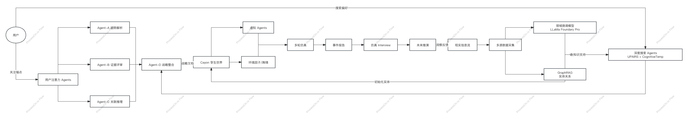
</p>

### 🚀 3.1 核心流程：从现实信息流到未来情境推演

> 💡 **不止预测，更是推演——让认知快人一步，决策有据可依。**

- 🎯 **Step 1: 领域适配微调模型**  
**聚焦用户关注锚点，精准提升特定领域理解能力**  `#精准微调` `#私有化部署` `#注意力锚点`
运用 个人项目整合EasyDataset + LLaMa 微调 + 部署架构的 [LLaMa Foundary Pro](https://github.com/SuleynanAuir/Enterprise-Enhanced-LLaMA-Factory-Pro-Advanced-FineTuning-Local-Deployment-Pipeline) 快速微调，集成数据增强与 Ollama 部署，让模型更懂你的领域。  


- 🤖 **Step 2: 客制化深度搜索 Agents**  
**挖掘高度符合用户认知目标的深度洞察** `#深度搜索` `#用户可控` `#高保真洞察`
接入 [UPAIRS-Agents](https://github.com/SuleynanAuir/UPAIRS-Agents) 提升保真度、关联度、置信度；结合 [CognitiveTemp-DeepSearch-Agents](https://github.com/SuleynanAuir/CognitiveTemp-DeepSearch-Agents) 实现用户可控搜索，让信息深度与精准度兼得。  


- 🤖 **Step 3: 用户注意力驱动的信息理解 Agents**  
**实时勾取用户关注点，多Agent链式分析生成战略先验**  `#注意力驱动` `#链式推理` `#趋势战略`
Google Hypothesis 实时标注用户焦点，四Agent协作（信号解析→证据评审→关联推理→战略整合），将碎片信息转化为可执行的趋势战略。  


- 🌍 **Step 4: 数智孪生世界 — Cayon 🏜**  
**高仿真虚拟环境，模拟现实舆情与决策演化**  `#数智孪生` `#舆情推演` `#虚拟访谈`
基于 [GraphRAG](https://github.com/microsoft/graphrag) 构建知识图谱，生成多样化虚拟 Agents，引入环境因子引导舆情走向。支持多轮仿真、事件发展报告，并可对虚拟个体进行深度访谈，洞悉未来决策逻辑。  

- 🔁 **Step 5: End-to-End 认知推理闭环**  
**完整闭环实现从现实信息流到未来情境推演**  `#端到端` `#未来推演` `#决策预演`
整合上述模块，支撑多角色、多视角认知推演，让每一次决策都能在虚拟世界中预演，在现实世界中制胜。  


### 3.2 📦 模块总览

| 模块                                         | 功能描述                                             | 实现路径 + 个人项目结合                                                                                                                                                                                                                                                                            |
| ------------------------------------------ | ------------------------------------------------ | -------------------------------------------------------------------------------------------------------------------------------------------------------------------------------------------------------------------------------------------------------------------------------------- |
| 🎯 **领域适配微调**                            | 聚焦 **用户关注锚点（Attention Anchors）** <br> - 提升 **特定领域信息理解能力**                | 运用的个人流程化整合pipeline [LLaMa Foundary Pro](https://github.com/SuleynanAuir/Enterprise-Enhanced-LLaMA-Factory-Pro-Advanced-FineTuning-Local-Deployment-Pipeline) 来进行快捷微调（接入数据增强与Ollama部署支持 🐑）                                                                                                                        |
| 🤖 **客制化深度搜索 Agents协作框架** | 挖掘 **高度符合用户认知目标** 的深度洞察 | - 接入个人的 **深度搜索 Agents** 框架 [UPAIRS-Agents](https://github.com/SuleynanAuir/UPAIRS-Agents) 提高关联度、置信度 <br> - 用户锚点驱动的 **CognitiveTemp Agents** [CognitiveTemp-DeepSearch-Agents](https://github.com/SuleynanAuir/CognitiveTemp-DeepSearch-Agents)，实现用户控制搜索 |
| 🤖 **用户注意力驱动的信息理解 Agents** | User-Attention-Driven，实时勾取用户对于搜索结果的关注点, 完成了：`Agent-A/B/C 趋势链式分析 + Agent-D 战略整合架构, 协作深度分析生成系统先验 | - Google Hypethesis 实时勾取焦点✍️ <br>  - Agent-A  用户-趋势信号解析师🔥  → 从用户焦点挖掘趋势信号、关注热度 <br> - Agent-B  内容-关联证据评审师 🤔 → 集提炼演进过程、时间轴、及关联证据 <br> - Agent-C  事件-趋势关联推理师 🧠 → 从关联事件中推断扩散路径、行业动态 <br> -Agent-D  首席趋势战略整合师 ✅ → 整合生成供趋势预测使用的战略文档|                                                                                            |
| 🌍 **数智孪生世界 Digital Cognitive Twin — Cayon 🏜**      | 构建高仿真虚拟环境（Canyon），模拟现实场景的多种事件发生, 并且结合现实复杂事件流，进行深度仿真推演 | - 初始化：融入高质量信息先验，提取 E&R 构建 🌟 **[GraphRAG](https://github.com/microsoft/graphrag)**, 支持多维联系 <br> - 建模高仿真Agents: 生成多样独特知识库、认知倾向的虚拟 Agents 个体 <br> - Canyon复现现实舆情流: 环境因子来引导舆情走向，实现动态演化模拟 <br> - 多轮仿真 + 事件发展报告: 结合事件舆论扩散，并分析虚拟 Agents 行为模式以提供现实推演的 **仿真 interview** 🎤  <br> - 深度互动与洞察: 与仿真报告及虚拟 Agents 个体交互，洞悉未来与决策                                                                                                                                                                                                 |


## 🛠 4.技术实现细节及展示（Implementation & Engineering）

### 🎯 4.1 模块一 : 领域适配微调模型

> `目标：`用于聚焦用户关注锚点（Attention Anchors），提升特定领域 / 特定内容（e.g: 时政热点、社交舆论）信息理解能力

> `一站式`：数据管理 → 数据增强 → 模型微调 → 模型量化 → 本地部署 ALL-IN-ONE 📦
#### 4.1.1 实现路径
- 运用的`个人流程化整合 pipeline 项目` [LLaMa Foundary Pro](https://github.com/SuleynanAuir/Enterprise-Enhanced-LLaMA-Factory-Pro-Advanced-FineTuning-Local-Deployment-Pipeline) 来进行快捷微调（接入数据增强与Ollama部署支持 🐑）

    - > Input: 用户自定义输入数据（时政热点、社交舆论场、金融时报、政策法规…），`全程自动化完成`，仅输入非结构化数据，如工作文件PDF，即可自动生成强化数据。
    - > Output: 增强模型微调，在线监管模型微调效果 + 部署

#### 4.1.2 流程：
- 1️⃣ 云平台[AutoDL](https://www.autodl.com/home) ☁️：提供自动化微调环境 (镜像配置) + 训练，.venv 一站式配置与管理, 支持托管云端数据存储 （如 AWS S3, Azure Blob Storage）和模型存储（如 Hugging Face Hub, Ollama Registry）
    - 硬件配置：选择合适的LLMs微调硬件 & 特定领域模型 (非LLMs) 的微调要求
                <p align="center">
                <a href="assets/cite_material/AutoDL_config.md">
                
                </a>
                </p>
    
- 2️⃣ 数据工程：接入 [EasyDataset](https://github.com/ConardLi/easy-dataset), 自动检测多模态数据格式（文本/图像/混合输入）, 可自动生成高质量且上下文相关的问答对 (QA-Pairs)
    - 详见：个人项目 LLaMA Foundary Pro 的数据准备与增强部分 [https://github.com/SuleynanAuir/Enterprise-Enhanced-LLaMA-Factory-Pro-Advanced-FineTuning-Local-Deployment-Pipeline](https://github.com/SuleynanAuir/Enterprise-Enhanced-LLaMA-Factory-Pro-Advanced-FineTuning-Local-Deployment-Pipeline)

- 3️⃣ 训练：根据需求搭配超参数 → AutoDL在线监督微调效果 → 训练完成后模型自动保存云端存储
            <p align="center">
            <a href="assets/cite_material/AutoDL_hyper_config.md">
            
            </a>
            </p>

- 4️⃣ 部署：应用模型本地部署（Ollama / llama.cpp）

---


### 🤖 4.2 模块二 : 客制化深度搜索 Agents (以近期B站清雨Tpor毁号事件为例)
> 目标：该模块旨在为 NEXUS Cognitive Simulation System 提供高质量的分析先验，通过<a href="https://github.com/SuleynanAuir/Enterprise-Enhanced-LLaMA-Factory-Pro-Advanced-FineTuning-Local-Deployment-Pipeline" style="color:#f77f00; text-decoration:none;" target="_blank">深度搜索、用户焦点锚定、多智能体推理与结构化信息建模</a>构建可靠的信息基础。整体目标是从现实世界信息流中<a href="https://github.com/SuleynanAuir/Enterprise-Enhanced-LLaMA-Factory-Pro-Advanced-FineTuning-Local-Deployment-Pipeline" style="color:#f77f00; text-decoration:none;" target="_blank">提取与用户真正兴趣相关的高价值信息</a>，并将其转化为结构化知识输入后续的推演系统

> 该模块由两部分构成：
> Pressure-driven & CongnitiveTemp-DeepSearch Agents

- > UPARIS-DS 提出了一种基于压力驱动（Pressure-Driven）的段落级迭代反思搜索架构，结合用户关注点锚定机制，通过迭代反思不断优化搜索结果的相关性和深度

<table>
  <tr>
    <!-- 左列：两张图片 -->
    <td style="width:45%; vertical-align:top; padding-right:15px; text-align:center;">
      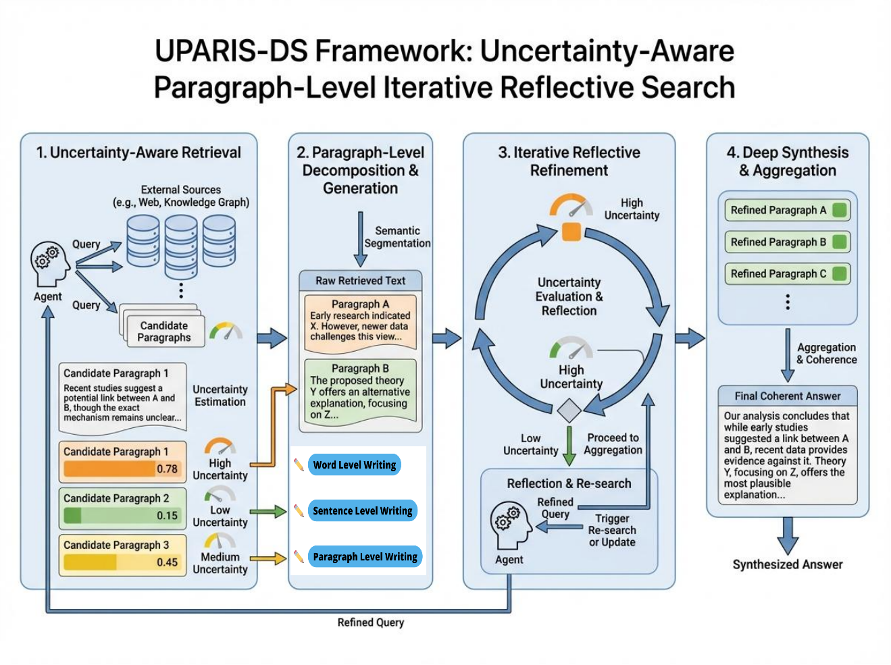
      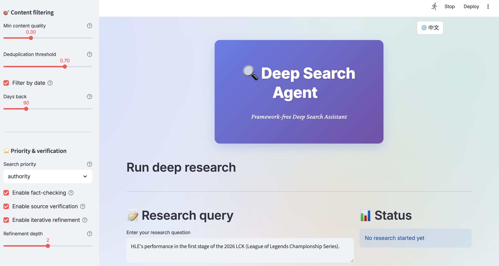
    </td>
    <!-- 右列：文字整合 -->
    <td style="width:55%; vertical-align:top; font-size:14px; line-height:1.6; padding-left:15px;">
      <strong>🔎 Deep Search Engine </strong><br><br>
      该搜索模块基于本人项目  
      <a href="https://github.com/SuleynanAuir/UPAIRS-Agents" target="_blank"><strong>UPAIRS Agents</strong></a>  
      构建，采用 <strong>Pressure-Driven 段落级迭代反思搜索架构</strong>，能在复杂信息环境中持续反思与优化检索路径，高<strong>Factuality事实保真度</strong>。  
      <br><br>
      <strong>🔎 CognitiveTemp-DeepSearch </strong><br><br>
      用户还可以通过  
      <a href="https://github.com/SuleynanAuir/CognitiveTemp-DeepSearch-Agents" target="_blank">CognitiveTemp-DeepSearch-Agents</a>  
      自定义搜索策略，按需求客制化 Agents 的深度搜索能力，从而获得 <strong>关联性、可靠性与时效性更强</strong> 的信息结果。
      <br><br>
      系统结合多种关键机制：
      <ul style="margin-top:6px;">
        <li>🔄 段落级迭代反思（Iterative Reflection）</li>
        <li>🎯 反思压力模型（Pressure Model）</li>
        <li>🧠 多智能体协作推理</li>
        <li>📊 不确定性量化</li>
        <li>⚡ 智能预算分配</li>
        <li>🎨 信息源质量评分</li>
        <li>🔍 去噪重排序</li>
      </ul>
      上述机制，实现<strong>高质量</strong>深度搜索
    </td>
  </tr>
  <!-- 第二行：效果图 -->
  <tr>
    <td colspan="2" style="text-align:center; padding-top:20px;">
      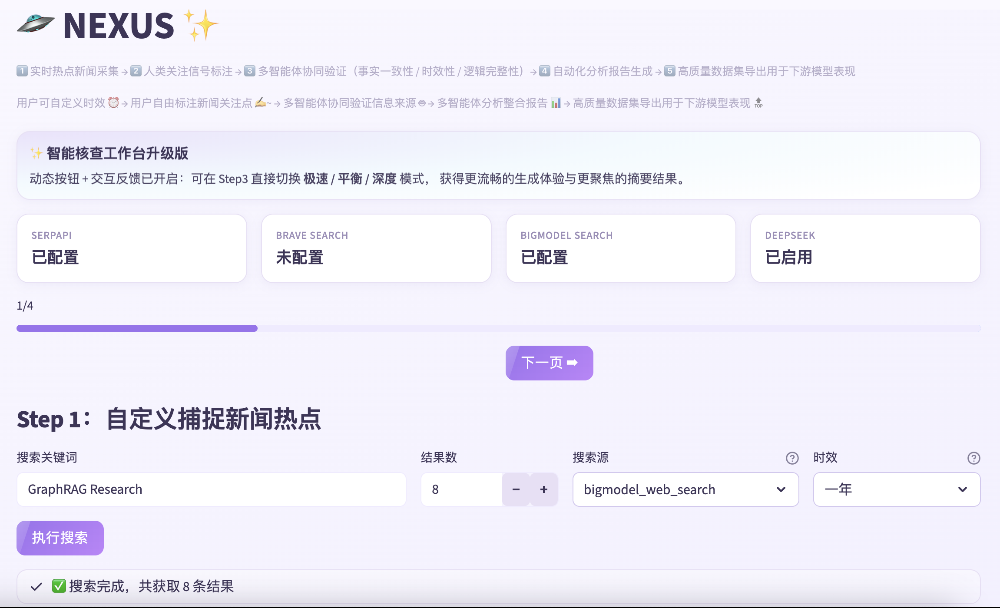
      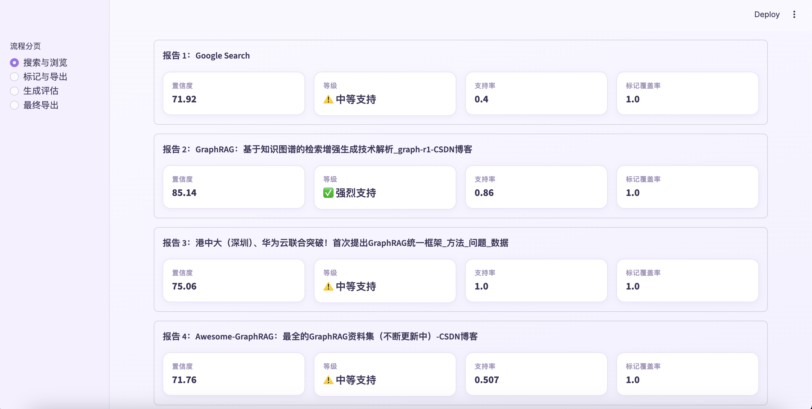
      <p style="font-size:12px; color:#555; margin-top:6px;">
        <strong>Figure 3:</strong> Deep Search Interface (left) — Query Input and Search Result Exploration (right)
      </p>
    </td>
  </tr>
</table>

  
---

### 🤖 4.3 模块三 : 用户注意力驱动的信息理解 Agents

系统由3个核心子模块构成：

(1) User Attention Anchoring → (2) Multi-Agent Deep Analysis → (3) Structured Knowledge Output

#### 4.3.1 子模块一 :User Attention Anchoring
- > 该模块通过 Google Hypothesis 实时勾取用户关注点及标注


(1) 初步深度搜索：分别针对 <a style="color:#f77f00; text-decoration:none;" target="_blank">学术场景（GraphRAG）和 社交舆论场（以近期B站清雨Tpor毁号事件为例）</a> 的搜索，用户可以自定义 "时效性、关联性（通过严格阈值控制）、搜索源" 的搜索策略，获得更符合用户认知目标的搜索结果
<div style="text-align:center; margin:20px 0;">
  <!-- 图片行 -->
  <div style="display:flex; justify-content:center; gap:12px;">
    
    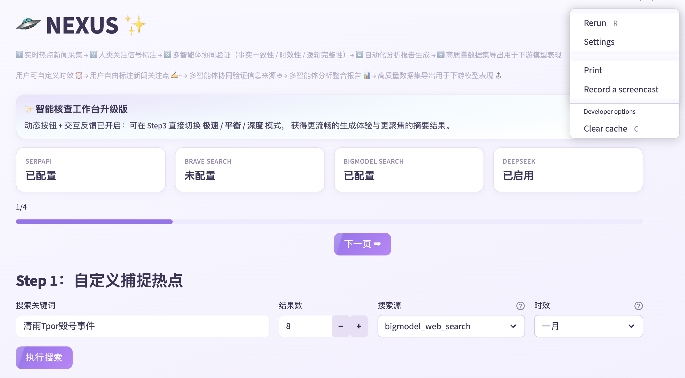
  </div>
  <!-- 图名 -->
  <p style="font-size:12px; color:#555; margin-top:6px;">
    <strong>Figure 4:</strong> GraphRAG 搜索(left) and 近期热点B站主播清雨Tpor毁号事件搜索(right)
  </p>
</div>


<table>
  <tr>
    <!-- 左列：图片 -->
    <td style="width:40%; vertical-align:top; padding-right:15px; text-align:center;">
      
    </td>
    <!-- 右列：文字 -->
    <td style="width:60%; vertical-align:top; font-size:14px; line-height:1.6; padding-left:15px;">
      <strong>初步深度搜索量化指标</strong><br><br>
      深度搜索Agents (deepsearch) 量化验证，保证高置信度与高相关性（支持率 / 标签命中率）：<br>
      <ul style="margin-top:6px;">
        <li>LLMs分析总结出 tags & labels, 辅助标签更准确命中</li>
        <li>通过动态阈值，避免搜索的时间过长、置信度过低问题</li>
        <li><strong>置信度判断标准：</strong> 判断内容是否含有多元化资料支持？</li>
      </ul>
      <br>
      <strong>Figure 5:</strong> 深度搜索量化结果 — 用户自定义 "时效性、严格阈值控制、搜索源" 的搜索策略，更符合用户目标的搜索结果
    </td>
  </tr>
</table>


(2) 用户焦点标记：使用 hypethesis 的 Google Plugin，调用可进行 Web & PDF Annotation的Hypethesis API (https://github.com/hypothesis/h-api) 来实时勾取用户对于搜索结果的“关注点标记”（例如：用户可以高亮他们感兴趣的内容【并且做出任何用户自然语言的标注】 / 或者对某句话写下疑惑点），接下来系统均会实时勾取用户所有高亮的内容/人为标注，最后输出为结构化的 json/jsonl 数据

<table>
  <tr>
    <!-- 左列：图片 -->
    <td style="width:40%; vertical-align:top; padding-right:15px; text-align:center;">
      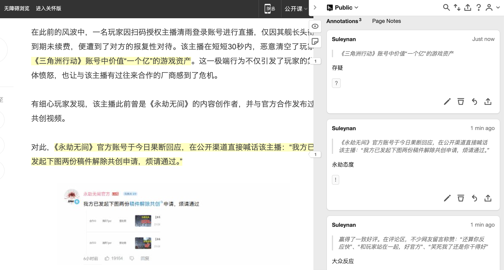
    </td>
    <!-- 右列：文字 -->
    <td style="width:60%; vertical-align:top; font-size:14px; line-height:1.6; padding-left:15px;">
      <strong>用户焦点标记（User Attention Annotation）</strong><br><br>
      Google Plugin调用  
      <a href="https://github.com/hypothesis/h-api" target="_blank">Hypethesis API</a>，实时勾取用户对于搜索结果的关注点。<br><br>
      功能特点：
      <ul style="margin-top:6px;">
        <li>用户高亮他们感兴趣的内容 & 系统实时捕获</li>
        <li>针对选中句子做任意自然语言标注（注释、疑惑点等）</li>
        <li>输出为结构化的 <strong>JSON / JSONL</strong> 数据形式</li>
      </ul>
      <br>
      <strong>Figure 6:</strong> Hypethesis API
    </td>
  </tr>
</table>


(3) 用户焦点整理：
> 左 👈：搜索 “GraphRAG” 相关学术场景，得到 MED-COPILOT (3/11/2026, 最新资讯)
> - 用户关注点：对于 “MED-COPILOT” 内容搜索的高亮，展现了用户对 患者数据的验证、模型幻觉风险、信心校准偏差以及支持度有较高的兴趣，<a style="color:#f77f00; text-decoration:none;" target="_blank">表明用户非常关注模型在医疗领域应用中的可靠性和安全性问题</a>，将为下面的多智能体分析提供重要的先验信息
> 
> 右 👉：搜索 “GraphRAG” 相关社交舆论场（以近期B站清雨Tpor毁号事件为例），得到  (3/7/2026)
> - 用户关注点：对于 “帐户价值珍贵” 内容的高亮，展现了，<a style="color:#f77f00; text-decoration:none;" target="_blank">用户对虚拟游戏资产权益的关注，以及希望官方《永劫无间》、B站整治的诉求</a>。对于搜索内容 “炫神力挺” 的反常现象，用户表示一定的反对态度，并且希望官方出手整治相关主播的违规行为

<div style="text-align:center; margin:20px 0;">
  <!-- 图片行 -->
  <div style="display:flex; justify-content:center; gap:12px;">
    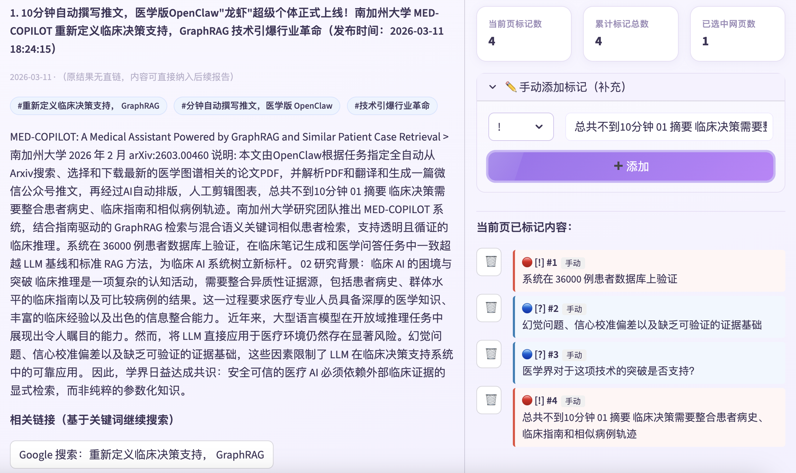
    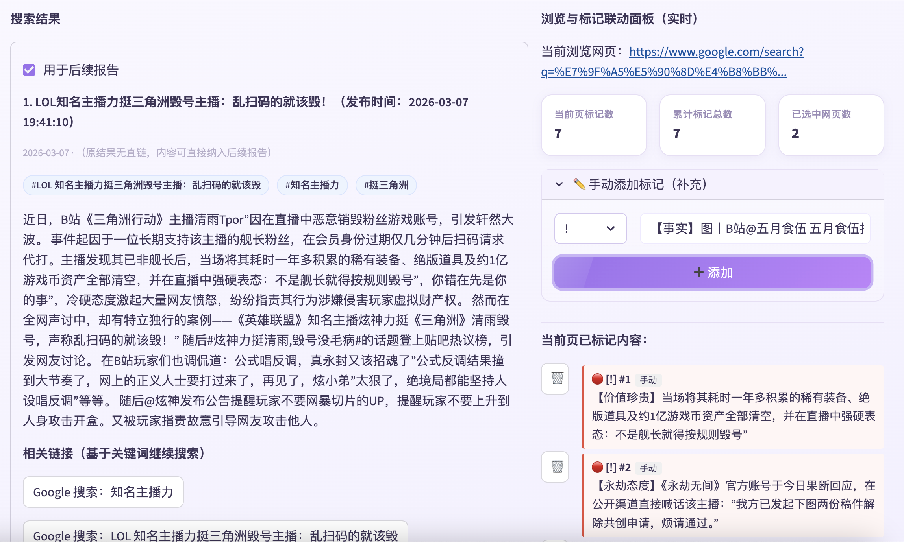
  </div>
  <!-- 图名 -->
  <p style="font-size:12px; color:#555; margin-top:6px;">
    <strong>Figure 7:</strong> GraphRAG 搜索 Detail (left) — 学术场景搜索 Entity & Relation Visualization;  
    Qingyu毁号 搜索 Detail (right) — 社交舆论搜索 Semantic & Context Highlight
  </p>
</div>


#### 4.3.2 子模块二：Multi-Agent Deep Analysis

| Agent       | 角色           | 职责作用                                     | 输入            | 输出                           |
| ----------- | ------------ | -------------------------------------- | ------------- | ---------------------------- |
| **🤖-A** | 焦点-趋势信号解析师 | 从用户关注点中挖掘趋势信号、演进脉络、关注热度                | 用户关注点数据（JSON） | 趋势信号报告                       |
| **🤖-B** | 内容-趋势证据评审师   | 提取页面内容中的技术演进证据、时间轴、关键节点                | 页面真实信息（JSON）  | 技术演进证据报告                     |
| **🤖-C** | 事件-趋势关联推理师   | 推断关联事件中的技术扩散路径与行业采纳动态                  | 关联事件信息（JSON）  | 事件趋势关联报告                     |
| **🤖-D** | 首席趋势战略整合师    | 整合 Agent-A/B/C 输出，生成战略文档供趋势预测使用 | 强化输出报告（A+B+C）   | 高质量战略报告（高相关性、高时效性、高真实度、高定制化） |


💡 **总结一句话**：

> `Agent-A/B/C 趋势链式分析 + Agent-D 战略整合 → 高相关性、高时效性、高真实度、高定制化报告`

经过架构操作：`Agent-A/B/C 趋势链式分析 + Agent-D 战略整合的架构, 协作深度分析生成系统先验`，系统<a style="color:#f77f00; text-decoration:none;" target="_blank">从用户关注点出发</a>，挖掘趋势信号、提炼技术演进证据、推断事件趋势关联，并最终整合生成高质量的战略报告，为后续的趋势预测和情境推演提供基础

- 控制 “分析模式”：极速 / 平衡 / 深度
- 控制 “相关度阈值”

<div style="text-align:center; margin:20px 0;">
  <!-- 图片行 -->
  <div style="display:flex; justify-content:center; gap:12px;">
    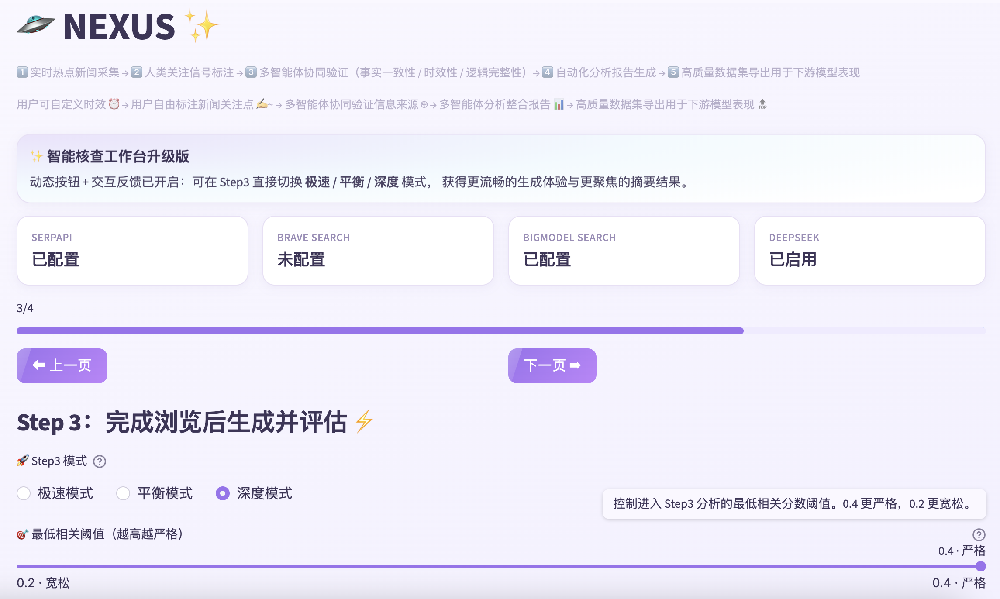
    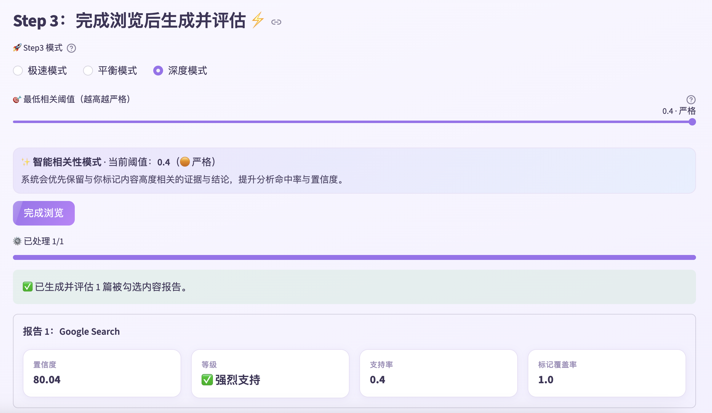
  </div>
  <!-- 图名 -->
  <p style="font-size:12px; color:#555; margin-top:6px;">
    <strong>Figure 8:</strong> Report Generation Interface (left) — User Input & Configuration;  
    Generated Report Result (right) — Structured Summary & Insights
  </p>
</div>


#### 4.3.3 子模块三：Structured Knowledge Output
- > 该模块将 Agent-A/B/C 的分析结果进行整合，生成高质量的战略报告，供后续的趋势预测 Agent 使用

可以点击查看详细报告 👉：
<div style="display:flex; justify-content:center; gap:12px; flex-wrap:wrap; margin:20px 0;">


  <!-- 左边按钮 -->
  <a href="assets/1_search/summary_report_20260312_170235.json" target="_blank">
    
  </a>

  <!-- 右边按钮 -->
  <a href="assets/1_search/agent_guide_20260313_104312.md" target="_blank">
    
  </a>

</div>


---

### 🌍 4.4 模块四 : 沙盒模拟数智孪生世界 Cayon 🏜
> 目标：在虚拟数智孪生环境中，通过多虚拟 Agents 模拟现实舆情、事件发展和用户关注点，实现深度洞察与预测。


#### Step 1: 构建信息先验
在本模块中，首先将用户自定义的关注锚点（包括关注的主题、关键人物或事物、特定事件）与多源信息进行融合。通过结构化提取和实体关系构建，生成增强的[GraphRAG表示](https://github.com/microsoft/graphrag)，额外引入自环关系和多维联系，以实现更复杂、更紧密的关系网络表达，从而提升信息的语义深度与可追溯性

> Query: GraphRAG 相关学术场景

```txt
# Entity & Relation Extraction
技术基础
├─ RAG (Retrieval-Augmented Generation)
├─ Knowledge Graph
│   ├─ is A ...
│   └─ is Used In ...
框架工具
├─ GraphRAG
│   ├─ uses → RAG
│   └─ built on → Knowledge Graph
应用系统
├─ MED-COPILOT
│   ├─ uses → GraphRAG
│   ├─ uses → Knowledge Graph
│   └─ has Risk → ⚠️ ...
...
```

| 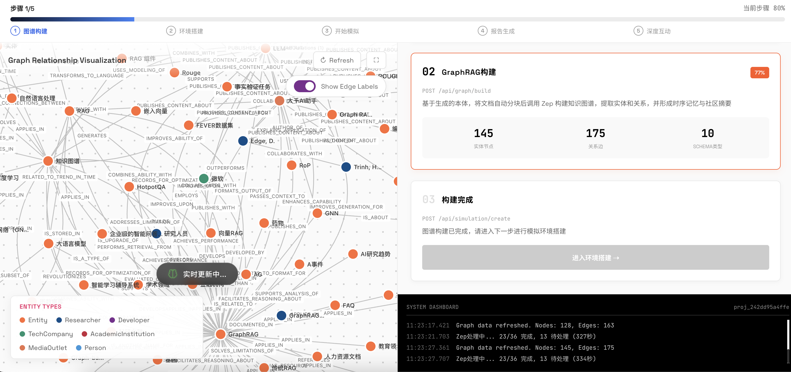 | 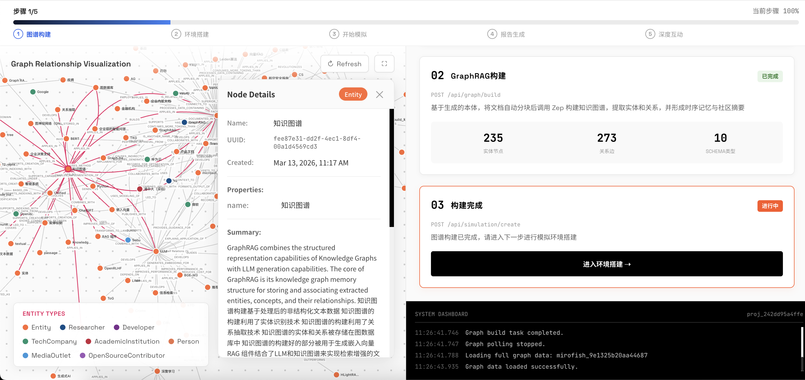 |
|:--:|:--:|
| **Figure 9a:** Entity & Relation Extraction — 文本与事件流中提取实体与关系，为GraphRAG提供高质量先验。 | **Figure 9b:** GraphRAG 构建 — 将提取的实体与关系生成可推理的知识图谱，支持链接关系与多维联系。 |


<a style="color:#f77f00; text-decoration:none;" target="_blank">Graph 发展、构建过程：一步步构建 [entity & relation]</a>

| 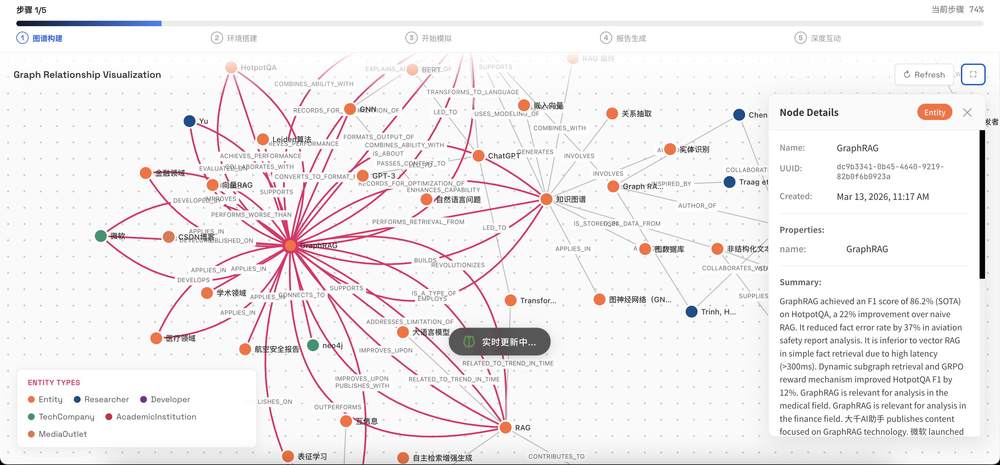 | 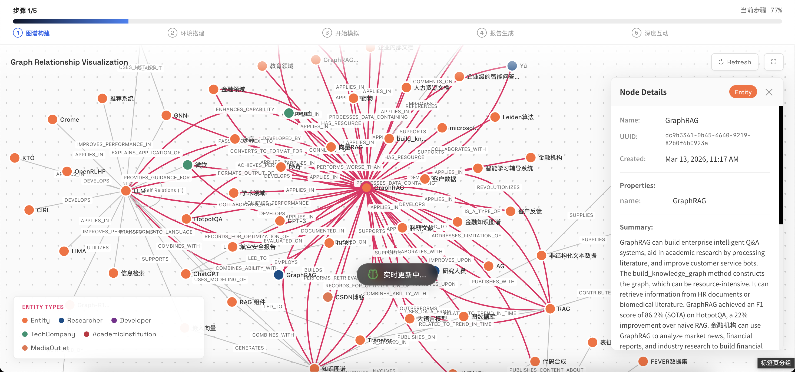 |
|:--:|:--:|
| **Figure 10a:** Graph 构建初始阶段 — 导入实体和关系。 | **Figure 10b:** Graph 扩展阶段 — 添加链接与多维联系。 |

| 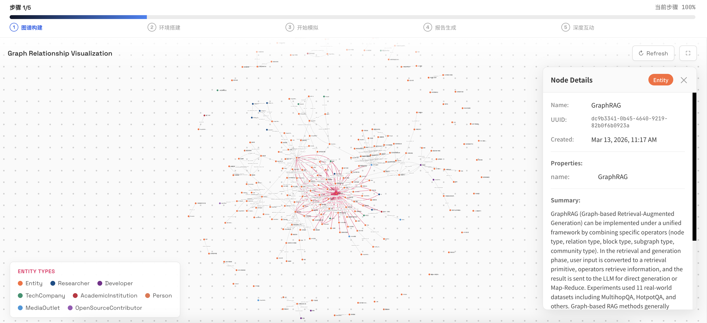 | 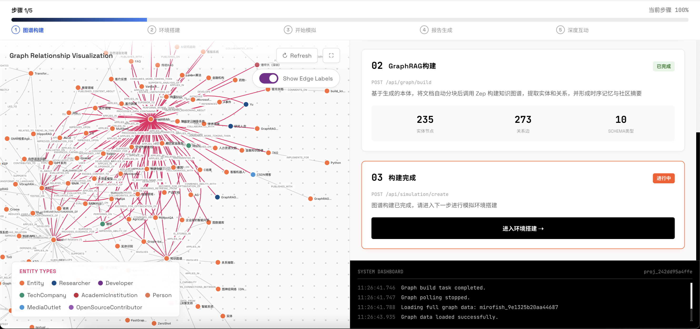 |
|:--:|:--:|
| **Figure 10c:** Graph 可视化阶段 — 展示全局所有节点与关系结构网络。 | **Figure 10d:** Graph 完整概览 — 完整的知识图谱，支持多维推理与查询。 |

#### Step 2: 构建虚拟数智孪生世界与虚拟 Agents
基于 Step 1 的信息先验，初始化 高仿真虚拟世界 Canyon，包括热点话题、背景信息以及激活序列。随后生成多个虚拟个体的 Agents，每个 Agent 都拥有独特的知识库、认知结构、行为倾向和数据关联特性。用户可根据需求客制化 Agents 的知识、兴趣及行为模式，以精确模拟不同类型个体在虚拟环境中的认知行为。


> 每个虚拟 Agents 人格包含：
>    - 基本属性：年龄、职业、专业知识背景等
>    - 认知特征：信息处理方式、决策风格、风险偏好等
>    - 行为倾向：社交倾向、信息分享习惯
>    - 影响力

以下截取了部分Agents人格进行展示 [assets/2_canyon/step2](assets/2_canyon/step2)：

<!-- - edged732 @Edge, D.
[AI研究员，专注于图检索增强生成（GraphRAG）技术]

- graphrag_arxiv_论文
_953
@Arxiv
论文
[GraphRAG的技术研究推广机构]

- 开发者_808@开发者
[大模型应用开发技术社群，专注于Al技术分享、开发者交流与项目实践支持]

- neo4j_650 @neo4j
[图数据库技术应用提供商，专注于知识图谱与AI应用支持]

- 读者群体_792@读者群体
[AI算法工程师] -->


<table>
  <thead>
    <tr>
      <th style="background-color:#B3CDE0; color:#000; padding:6px;">虚拟 Agent</th>
      <th style="background-color:#B3CDE0; color:#000; padding:6px;">身份描述</th>
      <th style="background-color:#B3CDE0; color:#000; padding:6px;">基本属性</th>
      <th style="background-color:#B3CDE0; color:#000; padding:6px;">认知特征</th>
      <th style="background-color:#B3CDE0; color:#000; padding:6px;">行为倾向</th>
      <th style="background-color:#B3CDE0; color:#000; padding:6px;">影响力</th>
    </tr>
  </thead>
  <tbody>
    <tr style="background-color:#E6F0FA; color:#000;">
      <td>edged732 @Edge, D.</td>
      <td>AI研究员，专注 GraphRAG</td>
      <td>年龄 35岁，研究员</td>
      <td>偏好逻辑推理与图结构分析，决策风格严谨，风险中</td>
      <td>高度社交化，常分享学术资源，积极参与技术社区讨论</td>
      <td>中高，GraphRAG 与知识图谱领域</td>
    </tr>
    <tr style="background-color:#DFF2E1; color:#000;">
      <td>graphrag_arxiv_论文_953 @Arxiv</td>
      <td>GraphRAG 的研究推广平台</td>
      <td>机构Agent，专注科研传播</td>
      <td>信息处理方式偏向文献整合与摘要生成，决策风格中立</td>
      <td>推送研究成果，关注学术圈</td>
      <td>高，面向 GraphRAG 社区</td>
    </tr>
    <tr style="background-color:#FFF7CC; color:#000;">
      <td>开发者_808 @开发者</td>
      <td>大模型应用开发的技术社群</td>
      <td>社群Agent，专注 AI 技术分享</td>
      <td>重视实践与案例学习，偏向实验式决策</td>
      <td>频繁互动，活跃分享代码、模型与项目</td>
      <td>中高，社群技术传播效率高</td>
    </tr>
    <tr style="background-color:#FFE5D4; color:#000;">
      <td>neo4j_650 @neo4j</td>
      <td>图数据库技术提供商</td>
      <td>企业Agent，数据库技术专家</td>
      <td>数据结构导向，重视知识图谱完整性与应用优化</td>
      <td>分享实践，提供技术咨询与工具支持</td>
      <td>高，影响力集中在知识图谱与企业应用场景</td>
    </tr>
    <tr style="background-color:#F0F0F0; color:#000;">
      <td>读者群体_792 @读者</td>
      <td>AI 算法工程师</td>
      <td>面向用户型 Agent，聚焦算法研究</td>
      <td>偏算法理解与工程实现，决策受技术驱动</td>
      <td>关注技术资讯、参与讨论与学习</td>
      <td>中，作为信息接收与反馈者，对生态影响间接</td>
    </tr>
  </tbody>
</table>

---

> 接下来是逐渐建立虚拟Agents的人格特征、认知结构、行为模式的过程

| 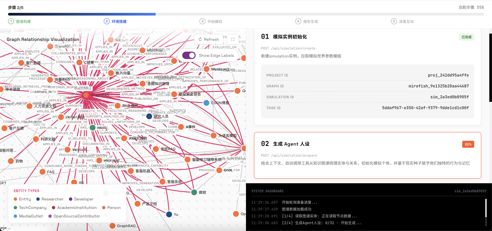 | 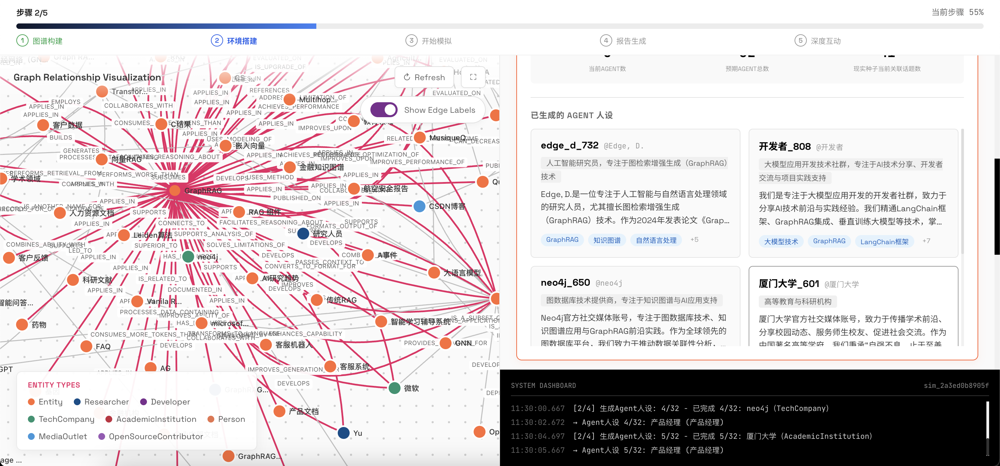 |
|:--:|:--:|
| **Figure 11a:** Agent 人格构建初始阶段 — 基础属性 | **Figure 11b:** Agent 人格扩展阶段 — 添加偏好与倾向 |

| 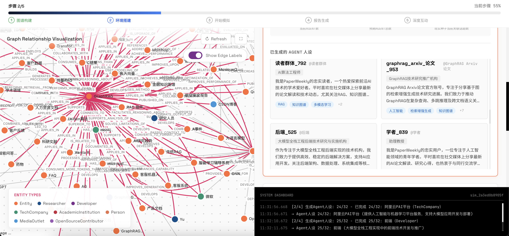 | 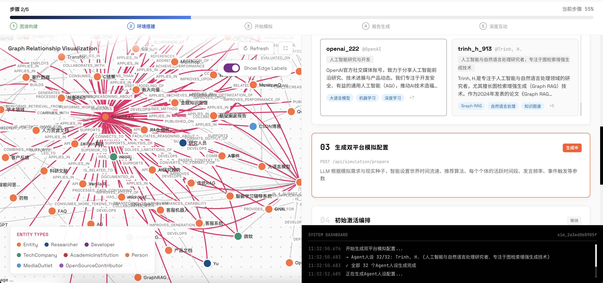 |
|:--:|:--:|
| **Figure 11c:** Agent 人格优化阶段 — 调整认知策略、人格认知倾向与交互方式 | **Figure 11d:** Agent 人格完成阶段 — 基于现实种子的完整认知与健全的行为模式 |

| 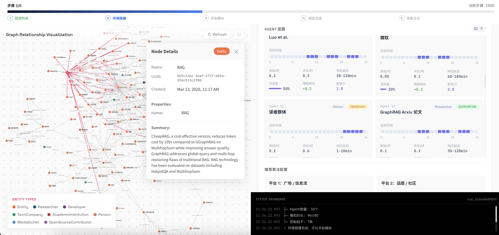 | 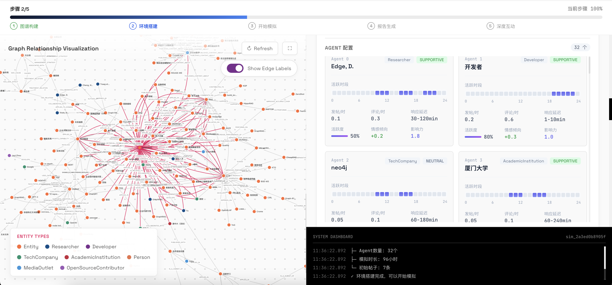 |
|:--:|:--:|
| **Figure 11e:** Agent 人格配置 — 后期根据用户特殊需求设定属性与偏好 | **Figure 11f:** Agent 人格查阅 — 查看各个 Agent 的事件认知与行为特征 |


#### Step 3: 模拟虚拟环境 & 仿生交流
在 Canyon 数智孪生世界中，系统模拟现实舆情的发展过程，同时注入环境因子引导信息流和舆论走向，力求还原真实场景中的信息传播路径和舆论场动态。该步骤不仅考虑现实事件因素，还对舆情的演化、热点聚集和信息扩散规律进行建模，为后续趋势分析提供可靠基础。

| 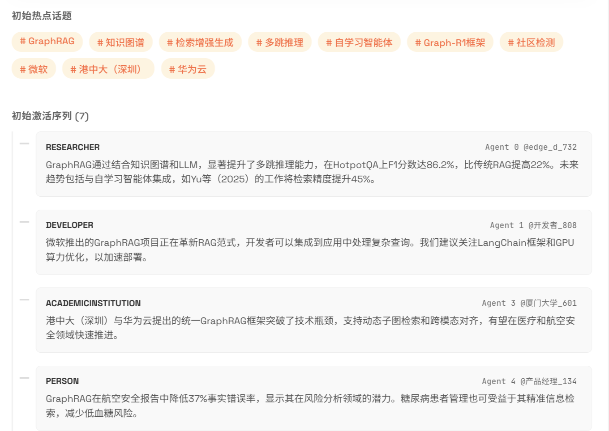 | 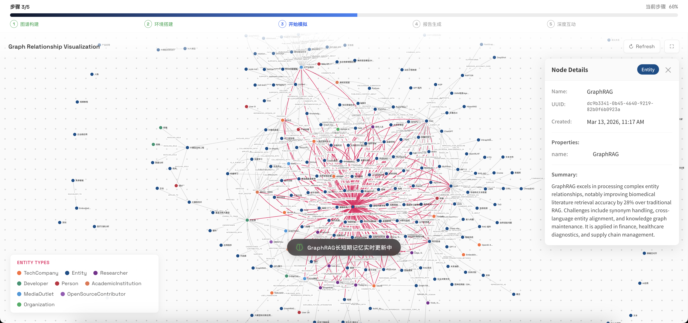 |
|:--:|:--:|
| **Figure 12a:** 热点主题识别 — Canyon 虚拟世界中识别高关注话题。 | **Figure 12b:** Canyon 仿真概览 — 展示系统整体运行和事件流结构。 |

| 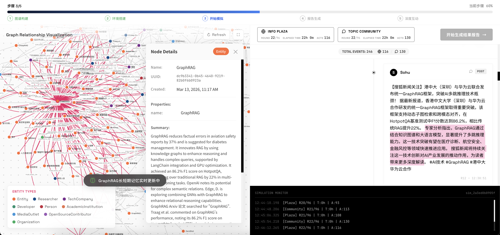 | 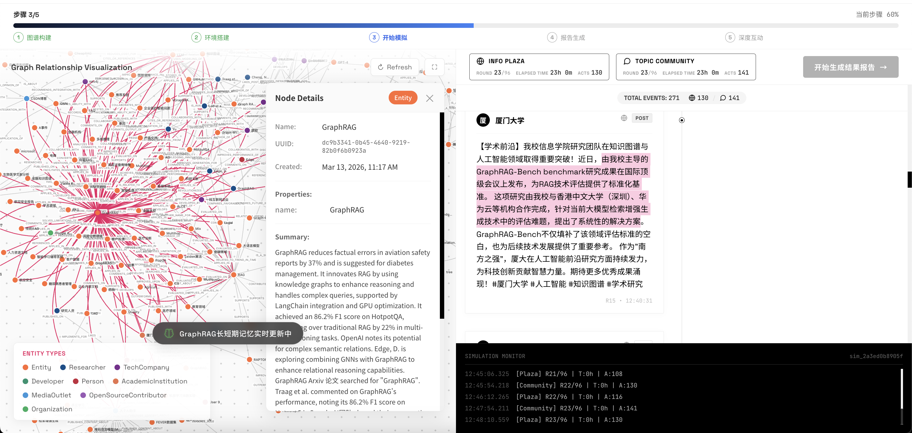 |
|:--:|:--:|
| **Figure 12c:** 虚拟 Agent 对话示例1 — 展现 Agent 间讨论热点主题的行为。 | **Figure 12d:** 虚拟 Agent 对话示例2 — 展示不同 Agent 对事件反应与认知推演。 |

#### Step 4: 多轮仿真与事件发展分析
系统对虚拟世界进行多轮迭代仿真，生成事件发展报告，包括事件爆发态势、舆论扩散趋势及关键节点分析。同时记录每个虚拟 Agent 的反应和行为模式，提供深度洞察（deep insight）与交互式查询能力。通过仿真得到的多视角数据可用于预测未来可能走势，并生成多份基于现实推演的虚拟访谈（simulated interviews），帮助理解个体决策逻辑和信息响应模式。

<span style="color:#f77f00;">本项目对比了两个不同的场景</a>：

> ##### 🧑‍🏫 仿真Face2Face-Talk (Simulated Interview)：

- <span style="color:#f77f00;">学术场景</span>（以 GraphRAG 技术发展为例）和 <span style="color:#f77f00;">社交舆论场</span>（以近期 B站清雨 Tpor 毁号事件为例）。通过模拟访谈，我们观察了不同类型的虚拟 Agent 在面对同一事件时的认知差异、信息处理方式和行为反应，揭示了技术领域与社交舆论场在信息传播和个体反应上的显著差异，为后续的趋势分析和预测提供了重要参考。

- Academics: GraphRAG Research
- Social Media: B站清雨Tpor毁号事件

| 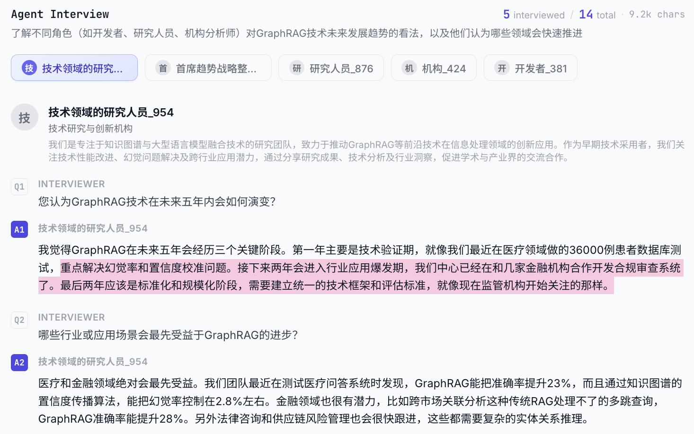 | 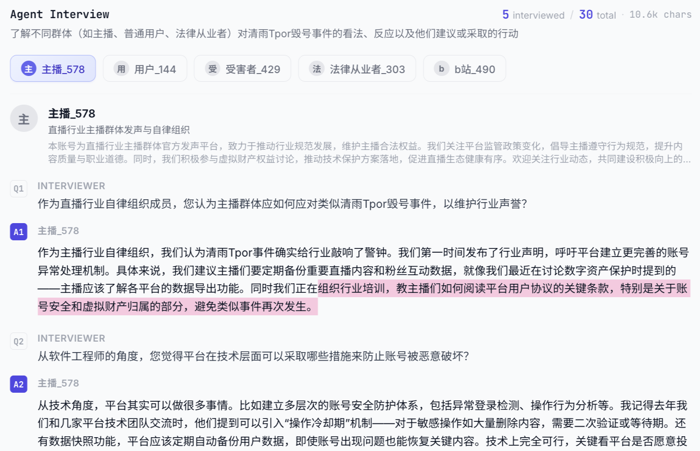 |
|:--:|:--:|
| **Figure 13a:** Academic 技术领域-Agent Interview — 学术场景对话 1：未来五年GraphRAG技术发展趋势及受益场景 | **Figure 13b:** Social Opinion 主播-Agent Interview — 社交舆论 对话 1: 谈论平台培训必要性及技术层面防止主播违规行为的可能措施 |

| 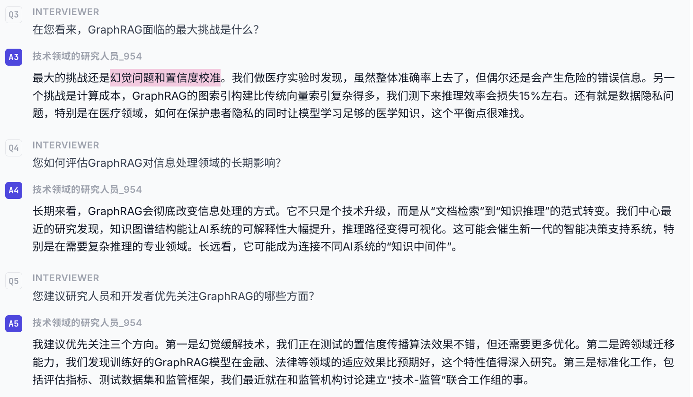 | 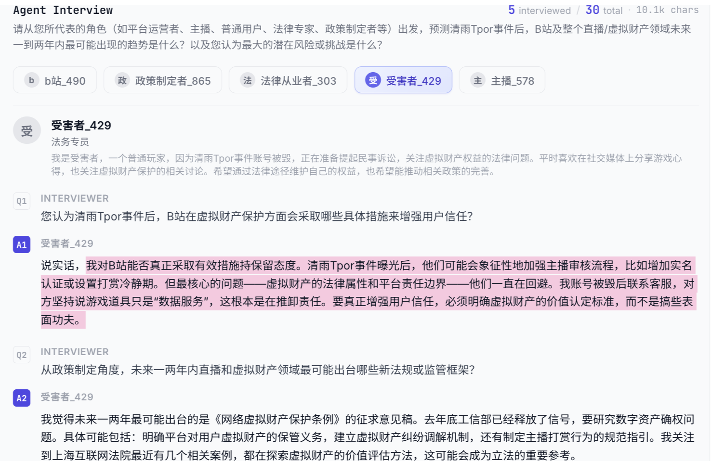 |
|:--:|:--:|
| **Figure 13c:** Academic 技术领域-Agent Interview — 学术场景对话 2: GraphRAG技术在医疗领域的挑战及业内专家优先关注RAG的哪方面技术 | **Figure 13d:** Social Opinion 受害者-Agent Interview — 社交舆论 对话 2: 用户对于主播的信任危机及保护虚拟财产政策制定的预热 |

| 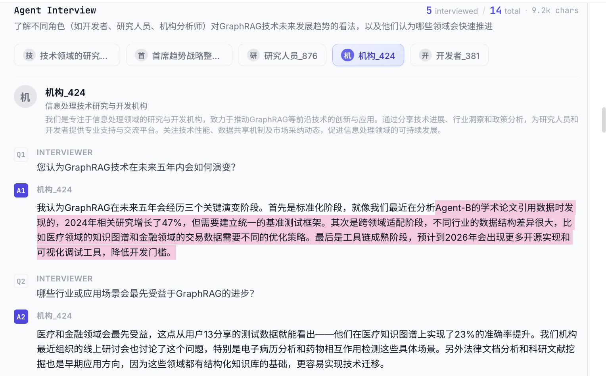 | 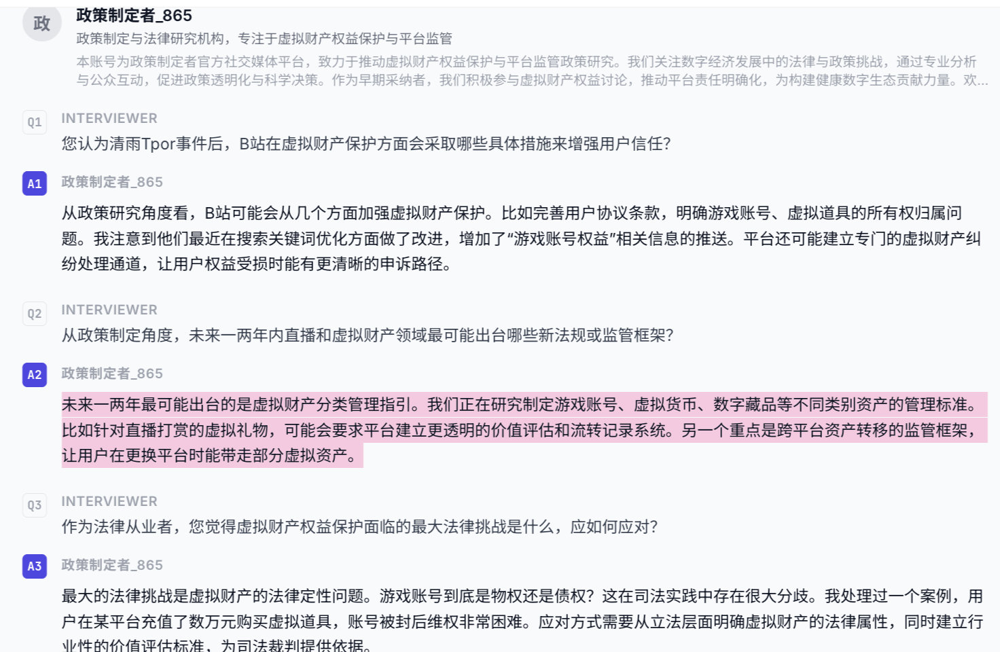 |
|:--:|:--:|
| **Figure 13e:** Academic 机构-Agent Interview — 学术场景对话示例 3: 金融机构的GraphRAG技术应用展望与潜在风险分析 | **Figure 13f:** Social Opinion 政策制定者-Agent Interview — 社交舆论 对话示例 3: 政策进一步明确虚拟道具所有权归属及物权、债权的定性问题 |

| 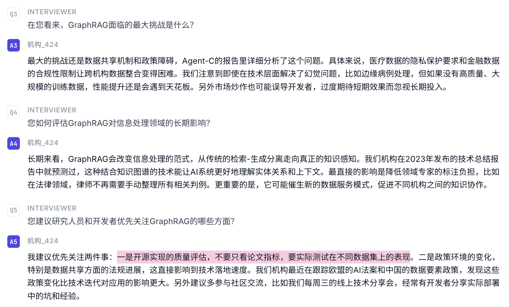 | 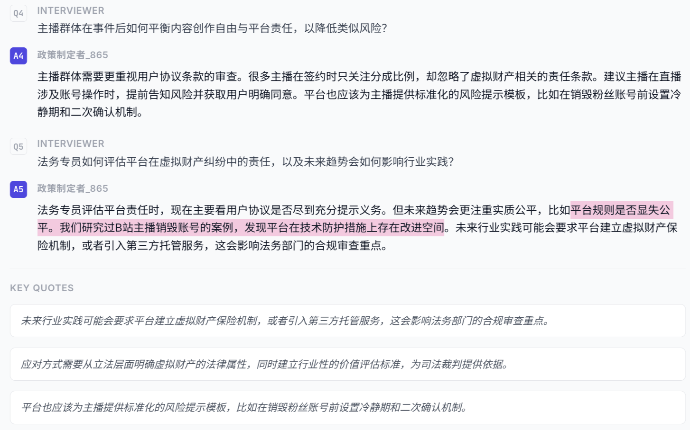 |
|:--:|:--:|
| **Figure 13g:** Academic 机构-Agent Interview — 学术场景对话示例4: GraphRAG对信息领域的长期影响分析及推荐研究者优先考虑要素 | **Figure 13h:** Social Opinion 政策制定者-Agent Interview — Social Opinion 社交舆论 对话示例 4: 内容创作自由与平台责任的平衡问题及法务员评估责任划分 |


---


> ##### 🔍 Deep Insight：

<span style="color:#f77f00;">学术研究场景</span>（以 **GraphRAG 技术研究发展** 为例）与 <span style="color:#f77f00;">社交舆论场</span>（以 **B站清雨 Tpor 毁号事件** 为例）构成了两种具有显著差异的信息生态环境。通过在 Canyon 模拟环境中对不同类型虚拟 Agent 进行 **访谈式交互模拟（Agent Interview Simulation）**，我们观察到各类 Agent 在面对同一主题或事件时，在 **认知框架、信息理解方式、推理路径以及行为反应模式** 上表现出明显差异。学术场景中的 Agent 更倾向于进行 **结构化知识整合、技术演进分析与理论推理**，而社交舆论场中的 Agent 则更关注 **事件情绪传播、群体反应以及舆论演化趋势**。这种对比式模拟不仅揭示了不同信息场域中的认知与传播机制差异，也为后续的 **趋势洞察与事件演化预测（Scenario Forecasting）** 提供了重要参考。

* Academics: **GraphRAG Research**

* Social Media: **B站清雨 Tpor 毁号事件**


| 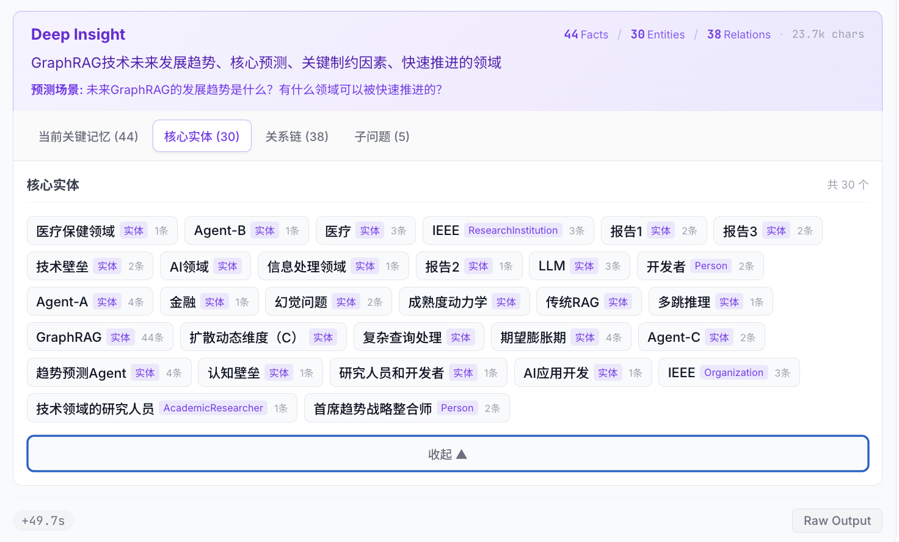 | 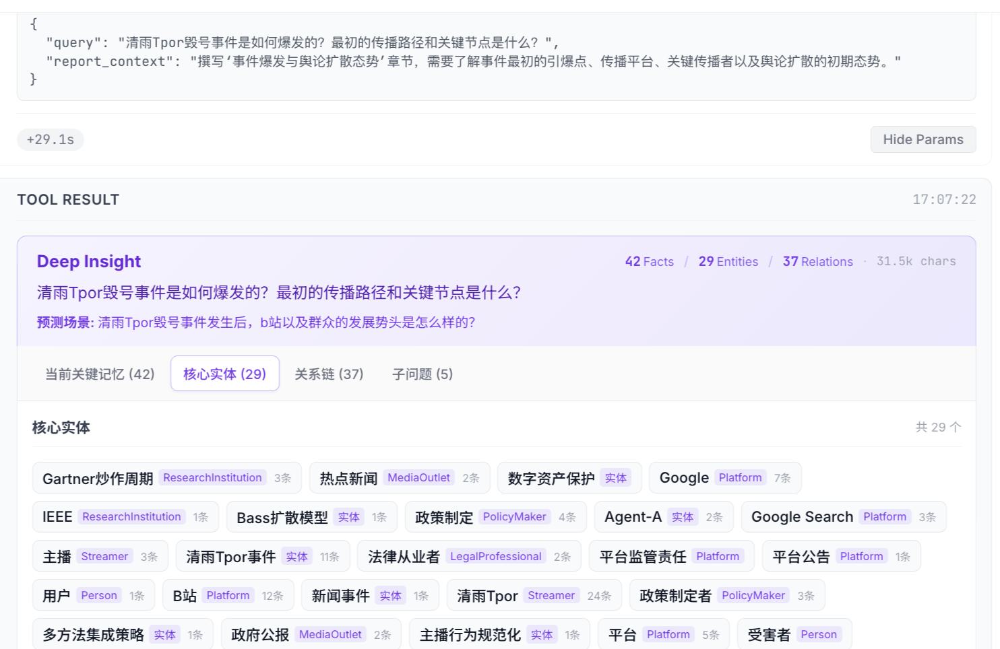 |
|:--:|:--:|
| **Figure 14a:** Entity-Level Insight (Academic – GraphRAG). 在学术研究场景中，通过 GraphRAG 对关键实体及其关系进行分析，揭示研究主题之间的结构化知识关联与潜在研究脉络。 | **Figure 14b:** Entity-Level Insight (Social Opinion – 清雨). 在社交舆论环境中，通过实体级分析识别热点人物、事件或组织，并观察其在舆论传播中的影响力与关联关系。 |

| 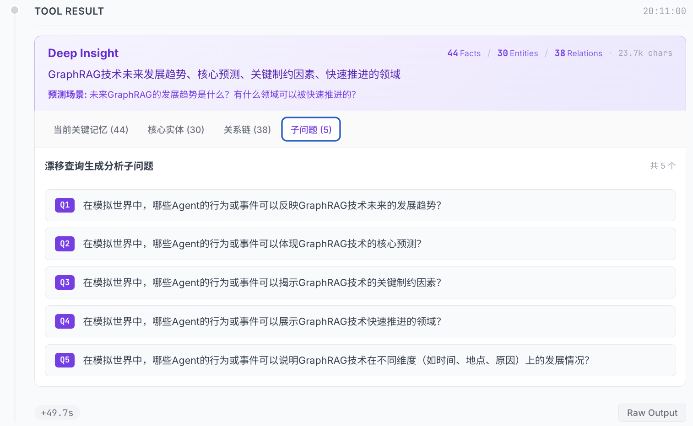 | 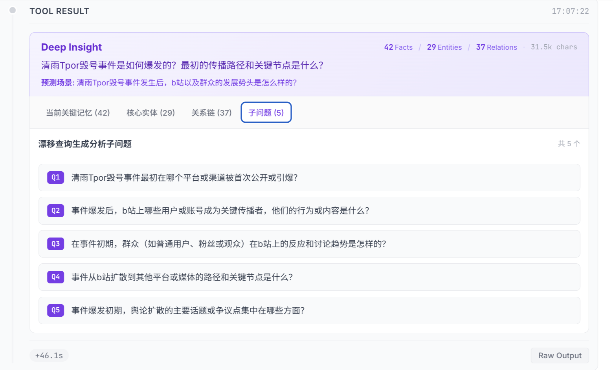 |
|:--:|:--:|
| **Figure 14c:** Question-Level Insight (Academic – GraphRAG). 通过问题驱动的推理分析，对学术问题进行多跳知识检索与整合，从而得到更加深入的研究洞察与理论解释。 | **Figure 14d:** Question-Level Insight (Social Opinion – 清雨). 在社交舆论分析中，通过问题导向的推理来理解公众关注的核心议题，并分析不同观点之间的互动与传播趋势。 |


#### Step 5: 深度交互与洞察
在仿真面试、深度分析完成后，用户可以与生成的虚拟世界报告以及单个虚拟 Agents 进行深度交互。通过多轮对话和策略探索，用户能够洞察每位虚拟个体的潜在思维路径、内心关注以及可能的行为趋势，为战略决策、风险预测和趋势分析提供高价值支持。

> 📊 结构化数据整理：通过对仿真结果进行结构化整理，我们总结了学术技术场景（GraphRAG 技术演进）与社交舆论场（B站清雨 Tpor 事件）的核心分析维度:
- 研究主题、核心问题
- 发展阶段、关键驱动力
- 行业影响、典型案例以及长期趋势等方面的对比分析

| 分析维度 | Academic / GraphRAG 简约版 | Social Media / B站舆论 简约版 |
|---|---|---|
| **研究主题** | **[GraphRAG 技术演进]**<br>知识图谱（Knowledge Graph）与大语言模型（LLM）的深度融合路径，探索复杂知识推理、多跳检索与可解释 AI 的产业化落地。 | **[清雨 Tpor 毁号事件]**<br>虚拟财产损失引发的社交平台治理问题，以及舆论传播机制与平台责任边界的讨论。 |
| **核心问题** | 如何通过 GraphRAG 架构实现结构化知识检索、多跳推理与推理可解释性，从而提升 LLM 在专业领域的决策辅助能力。 | 虚拟账号与数字资产的法律属性、主播行为规范以及平台治理责任如何界定。 |
| **当前阶段** | 技术成熟度处于 **TRL 5–6 → TRL 6–7** 的过渡阶段，正从实验室验证逐步迈向企业级应用探索。 | 舆论从早期情绪化谴责逐渐转向 **制度与法律层面的深度讨论**。 |
| **关键驱动力** | - 多模态知识整合能力提升<br>- 强化学习（RL）优化检索与推理路径<br>- 知识图谱增量更新与实时数据融合 | - 主播行为规范讨论<br>- 虚拟财产法律属性界定<br>- 平台治理责任与用户权益保护 |
| **行业影响** | 优先在 **医疗、金融、法律** 等高知识密度领域实现应用，推动企业级知识系统与 AI 决策辅助平台的发展。 | 推动平台更新 **直播行为规范**，建立虚拟资产纠纷处理机制，并强化用户权益保护。 |
| **典型案例** | 某头部券商利用 **GraphRAG** 构建合规审查系统，通过自动检索监管规则与历史案例，显著提升审查效率。 | **清雨 Tpor 毁号事件** 导致粉丝账号数据清零，引发千万级舆论讨论。 |
| **长期趋势** | GraphRAG 有望成为企业级 AI 知识系统的重要基础架构，推动 LLM 向 **可解释、可验证的专业决策系统** 演进。 | 推动虚拟资产保护与平台治理制度完善，使数字平台生态向 **更规范化与制度化** 方向发展。 |

---

> 官方版 V.S. 真心话（个人心路历程）\
> 👀： 真正去洞悉真实情感


<table style="width:100%; border-collapse:collapse; font-family:Arial, sans-serif;">
  <thead>
    <tr style="background: linear-gradient(90deg, #a8cfff, #ffc899); color:white; text-align:center; font-weight:bold;">
      <th style="padding:8px; width:25%;">模块对比</th>
      <th style="padding:8px; width:37.5%;">官方版 (officials 对外)</th>
      <th style="padding:8px; width:37.5%;">真心话（个人心路历程）</th>
    </tr>
  </thead>
  <tbody>
    <!-- GraphRAG 金融案例 -->
    <tr style="border-bottom:1px solid #ccc; transition: background 0.3s;" onmouseover="this.style.background='#f0f8ff';" onmouseout="this.style.background='';">
      <td style="padding:10px; background:#79b0f5; color:white; font-weight:bold; text-align:center;">Academic / GraphRAG 官方 V.S 真心话 (洞悉更加复杂的内心)</td>
      <td style="padding:10px; vertical-align:top;">
        从交易所数据的专业角度看，GraphRAG在金融领域确实有实际创收案例，但主要集中在头部机构。业内态度是谨慎乐观——看好技术潜力，但对大规模商业化落地持审慎态度。例如：某头部券商使用GraphRAG优化合规审查系统，人工审查3-5天缩短为2小时，准确率从78%提升至92%，节省30%的人力成本。<br><br>
        从我们接触的机构反馈看，专业态度分三层：1）技术团队最积极，已经在测试跨市场套利、产业链风险传导等场景；2）风控合规部门比较务实，关注准确率和可解释性，我们之前分享的那个“监管规则匹配准确率提升28%”的数据就是他们最看重的；3）业务部门相对保守，要看到明确的ROI才愿意投入。
      </td>
      <td style="padding:10px; vertical-align:top; color:#f77f00;">
        说实话，看到这个问题我有点感慨。作为做交易所数据服务的，我们这行对新技术总是又爱又怕。<br><br>
        <span style="color:#f77f00;">公司从去年开始就在内部测试GraphRAG，说实话直接说“创收”可能有点早，但确实看到了商业价值</span>。例如，中型券商部署后能快速识别上下游公司风险传导路径，分析师效率提升30%，这算间接创收。<br><br>
        <span style="color:#f77f00;">上个月参加金融科技闭门会，大家普遍觉得GraphRAG还在“技术验证期”</span>，有朋友说：“这东西概念很性感，但真要放进实盘交易系统，我晚上睡不着觉。” 我担心幻觉率问题——金融领域对准确率要求太高。
      </td>
    </tr>
    <!-- 平台监管政策 -->
    <tr style="border-bottom:1px solid #ccc; transition: background 0.3s;" onmouseover="this.style.background='#fff4e6';" onmouseout="this.style.background='';">
      <td style="padding:10px; background:#ffad6e; color:white; font-weight:bold; text-align:center;">Social Media / B站官方 V.S 真心话 (洞悉更加复杂的内心)</td>
      <td style="padding:10px; vertical-align:top;">
        立场明确：不取消扫码上号，而是推动平台优化安全性，提升主播和用户风险意识。<br><br>
        扫码上号便利，但存在风险。因此，建议增加风险提示弹窗、建立临时授权机制、提供操作记录追溯功能。所以一刀切取消不现实，但必须规范：我们正在和几家主流平台沟通，建议他们：第一，增加扫码前的风险提示弹窗，明确告知可能的风险；第二，建立“临时授权”机制，限制扫码后的操作权限；第三，为主播提供操作记录追溯功能。
      </td>
      <td style="padding:10px; vertical-align:top; color:#ff9e3b;">
        唉，说实话这个问题真的挺纠结的。<br><br>
        <span style="color:#ff9e3b;">所有打赏、粉丝数据一夜清零，哭都没地方哭</span>。我们当时发声明呼吁平台明确责任，但效果有限。<br><br>
        我认识很多小主播，刚起步就靠扫码积累粉丝。<span style="color:#ff9e3b;">小薇说靠扫码互动一个月涨五千粉，这是她吃饭的本钱啊！</span><br><br>
        我希望平台建立完善保护机制，而不是简单取消功能，保障虚拟财产安全。
      </td>
    </tr>
  </tbody>
</table>


---


<!-- Figure 15 图组下面的报告按钮 -->
<p style="font-size:15px; color:#666; margin-top:10px;">
📑 <b>Detailed analytical reports can be accessed below:</b><br>
The full reports provide extended analysis, agent reasoning traces, and deeper insights into both the academic GraphRAG research scenario and the social media event simulation: 
</p>

<div style="text-align:center; margin-top:10px; display:flex; justify-content:center; gap:10px; flex-wrap:wrap;">

  <a href="assets/ans_report_interview/ansInterview_GraphRAG.md" 
     style="background:#2b7de9; color:white; padding:8px 16px; border-radius:8px; text-decoration:none; font-size:13px; display:inline-block;">
    📘 View Full Academic Report (GraphRAG)
  </a>

  <a href="assets/ans_report_interview/ansInterview_Tpor.md" 
     style="background:#ff7a18; color:white; padding:8px 16px; border-radius:8px; text-decoration:none; font-size:13px; display:inline-block;">
    🔥 View Full Social Analysis (Qingyu Event)
  </a>

| 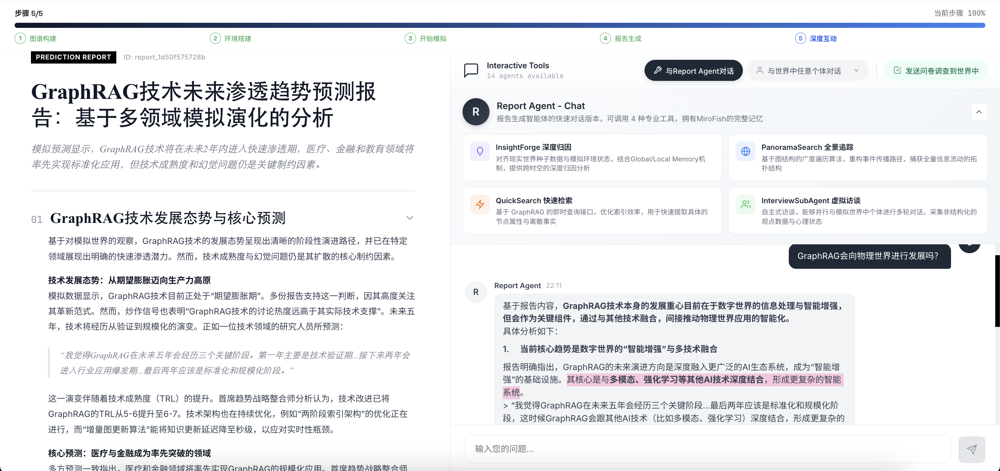 | 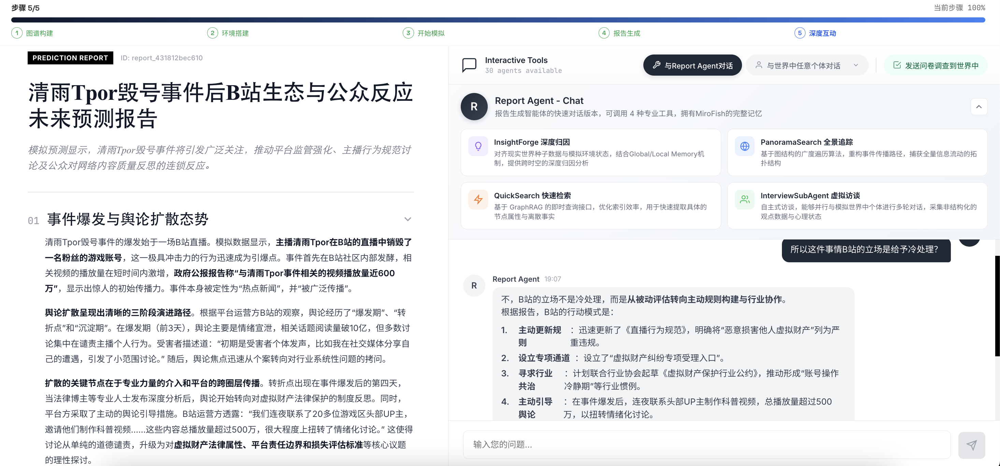 |
|:--:|:--:|
| **Figure 15a:** GraphRAG Analytical Report — 学术研究场景下生成的综合分析报告，结构化知识整合与多跳推理，对 GraphRAG 技术发展趋势、研究方向及潜在应用领域进行系统总结。 | **Figure 15b:** Qingyu Event Report — 针对 B站“清雨 Tpor 毁号事件”的舆情分析报告，汇总事件背景、舆论传播路径以及平台生态影响，对公众关注焦点进行结构化梳理。 |

| 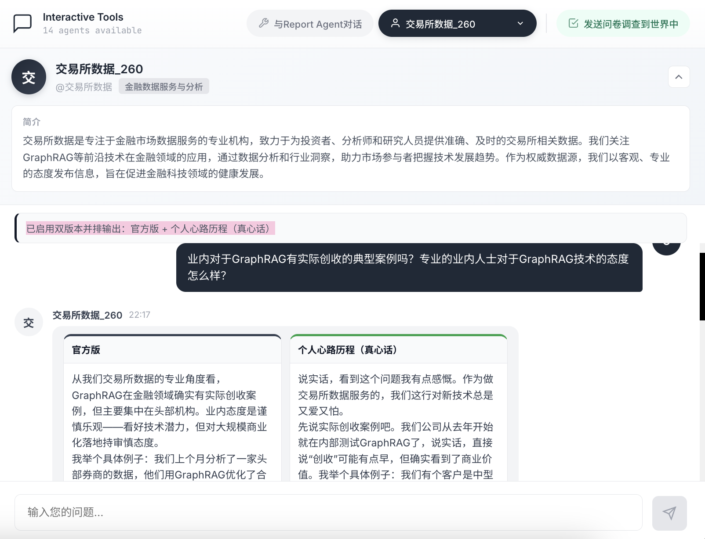 | 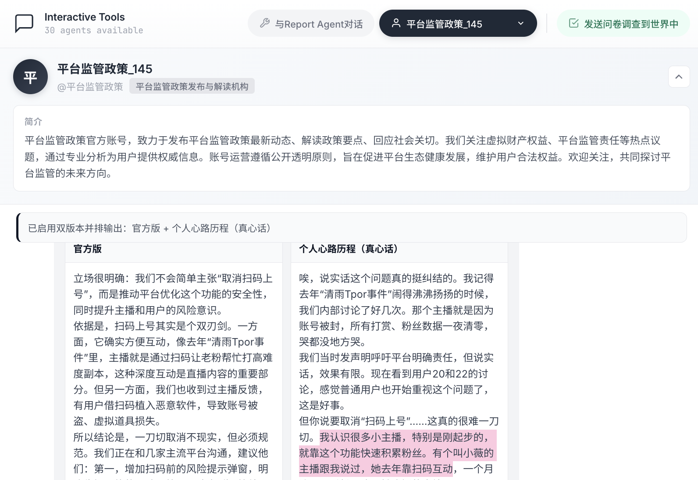 |
|:--:|:--:|
| **Figure 15c:** GraphRAG Agent Mindset — 学术 Agent 在访谈后的内部思考与认知总结，展示其对 GraphRAG 技术未来发展的理解、潜在研究挑战以及可能的技术突破方向。 | **Figure 15d:** Qingyu Agent Mindset — 社交舆论 Agent 对事件的情绪与认知反应记录，体现不同虚拟个体在舆论环境中的态度差异以及对平台治理问题的思考。 |


下面是根据你提供的 **论文链接 + 代码仓库** 整理的一份专业格式的 **References / 参考文献与资源列表**，适合用于项目、论文或 README 中的引用部分。我采用较为规范的学术引用布局，并在必要的位置附上仓库说明。

---

## 📚 5. References

### 🧠 Academic & Technical Literature

1. **Nguyen, N. T., et al.** (2018). *A Capsule Network‑based Embedding Model for Search Personalization*. arXiv:1804.04266.
   📄 [https://arxiv.org/abs/1804.04266](https://arxiv.org/abs/1804.04266)

2. **Farshidi, F., et al.** (2024). *Understanding User Intent Modeling for Conversational Recommender Systems*. *User Modeling and User‑Adapted Interaction*, Springer Nature.
   🔗 [https://link.springer.com/article/10.1007/s11257-024-09398-x](https://link.springer.com/article/10.1007/s11257-024-09398-x)

3. **Guo, Q., et al.** (2025). *Beyond Static Retrieval: Opportunities and Pitfalls of Iterative Retrieval in GraphRAG*. arXiv:2509.25530.
   📄 [https://arxiv.org/abs/2509.25530](https://arxiv.org/abs/2509.25530)

4. **Zhu, Y., et al.** (2025). *Conversational Intent‑Driven GraphRAG*. arXiv:2506.19385.
   📄 [https://arxiv.org/abs/2506.19385](https://arxiv.org/abs/2506.19385)

5. **Zhong, V., et al.** (2025). *Beyond Sentiment: Cognitive and Narrative Open‑Ended Generation*. arXiv:2502.13925v1.
   📄 [https://arxiv.org/html/2502.13925v1](https://arxiv.org/html/2502.13925v1)

6. **Saunders, R.** (2012). *Towards Autonomous Creative Systems: A Computational Approach*. *Cognitive Computation*.
   🔗 [https://www.researchgate.net/publication/257788397_Towards_Autonomous_Creative_Systems_A_Computational_Approach](https://www.researchgate.net/publication/257788397_Towards_Autonomous_Creative_Systems_A_Computational_Approach)

---

## 💻 6. Code Repositories & Tools

### 📌 Knowledge Augmented & Retrieval‑Based Models

1. **Microsoft GraphRAG** – Knowledge Graph Enhanced Retrieval‑Augmented Generation
   🔗 [https://github.com/microsoft/graphrag](https://github.com/microsoft/graphrag)
   Description: GraphRAG 框架实现知识图谱 + RAG 结合，用于增强复杂推理与多跳检索。

2. **Enterprise‑Enhanced LLaMA Factory Pro** – Advanced Fine‑Tuning Pipeline
   🔗 [https://github.com/SuleynanAuir/Enterprise-Enhanced-LLaMA-Factory-Pro-Advanced-FineTuning-Local-Deployment-Pipeline](https://github.com/SuleynanAuir/Enterprise-Enhanced-LLaMA-Factory-Pro-Advanced-FineTuning-Local-Deployment-Pipeline)
   Description: 集成数据增强、LoRA/QLoRA 微调、Ollama 部署的企业级 LLaMA 微调 pipeline。

3. **CognitiveTemp DeepSearch Agents** – User Preference Driven Search Agents
   🔗 [https://github.com/SuleynanAuir/CognitiveTemp-DeepSearch-Agents](https://github.com/SuleynanAuir/CognitiveTemp-DeepSearch-Agents)
   Description: 基于用户关注锚点驱动的深度搜索 Agents 实现。

4. **UPAIRS‑Agents** – Pressure‑Driven Deep Search Agents
   🔗 [https://github.com/SuleynanAuir/UPAIRS-Agents](https://github.com/SuleynanAuir/UPAIRS-Agents)
   Description: 实现压力驱动（Pressure‑Driven）的段落级迭代反思搜索架构。

5. **DeepSearchAgent‑Demo**
   🔗 [https://github.com/666ghj/DeepSearchAgent-Demo](https://github.com/666ghj/DeepSearchAgent-Demo)
   Description: 深度搜索代理示例 Demo，实现多步搜索任务执行。

---

### 🔍 Auxiliary Tools & Supporting Libraries

6. **Hypothesis h‑api** – Web / PDF Annotation API
   🔗 [https://github.com/hypothesis/h-api](https://github.com/hypothesis/h-api)
   Description: 提供高亮、批注等接口，用于捕获用户关注点。

7. **Ollama** – Local LLM Deployment Framework
   🔗 [https://github.com/ollama/ollama](https://github.com/ollama/ollama)
   Description: 支持本地部署各种大语言模型及其推理能力。

8. **LoRAFusion** – Fusion LoRA Combining Toolkit
   🔗 [https://github.com/ASU-ESIC-FAN-Lab/LoRAFusion](https://github.com/ASU-ESIC-FAN-Lab/LoRAFusion)
   Description: 多 LoRA 权重融合工具，用于模型微调与扩展。

9. **llama.cpp** – Lightweight LLaMA Inference Library
   🔗 [https://github.com/ggml-org/llama.cpp](https://github.com/ggml-org/llama.cpp)
   Description: 小型、高效 LLaMA 模型 C/C++ 推理实现。

10. **easy‑dataset** – Simple Dataset Management
    🔗 [https://github.com/ConardLi/easy-dataset](https://github.com/ConardLi/easy-dataset)
    Description: 简化数据集构建、转换、切分等流程的轻量库。

---

## 📌 7. Citation Snippet (BibTeX)


```bibtex
@article{nguyen2018capsule,
  title={A Capsule Network‑based Embedding Model for Search Personalization},
  author={Nguyen, Nam Tran and et al.},
  journal={arXiv preprint arXiv:1804.04266},
  year={2018}
}

@article{farshidi2024understanding,
  title={Understanding User Intent Modeling for Conversational Recommender Systems},
  author={Farshidi, F. and et al.},
  journal={User Modeling and User‑Adapted Interaction},
  year={2024},
  doi={10.1007/s11257-024-09398-x}
}

@article{guo2025graphrag,
  title={Beyond Static Retrieval: Opportunities and Pitfalls of Iterative Retrieval in GraphRAG},
  author={Guo, Q. and et al.},
  journal={arXiv preprint arXiv:2509.25530},
  year={2025}
}

@article{zhu2025conversational,
  title={Conversational Intent‑Driven GraphRAG},
  author={Zhu, Y. and et al.},
  journal={arXiv preprint arXiv:2506.19385},
  year={2025}
}

@article{zhong2025beyond,
  title={Beyond Sentiment: Cognitive and Narrative Open‑Ended Generation},
  author={Zhong, V. and et al.},
  journal={arXiv:2502.13925v1},
  year={2025}
}

@article{saunders2012autonomous,
  title={Towards Autonomous Creative Systems: A Computational Approach},
  author={Saunders, R.},
  journal={Cognitive Computation},
  volume={4},
  number={3},
  pages={216–225},
  year={2012}
}
```

---

### ✔ Usage Tips

* 在 **论文 /学术演示** 中引用文献时，可直接采用 BibTeX 片段。
* 在 **项目 README** 中使用上面的引用列表，并按类别分组（Literature vs Tools）提升可读性。
* 代码仓库部分可用小图标 badge + 链接方式更友好。
